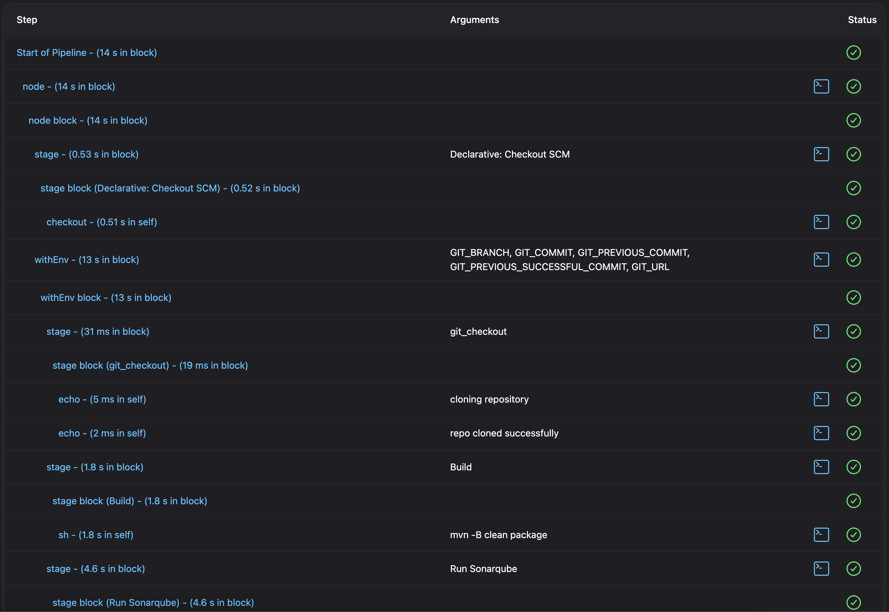
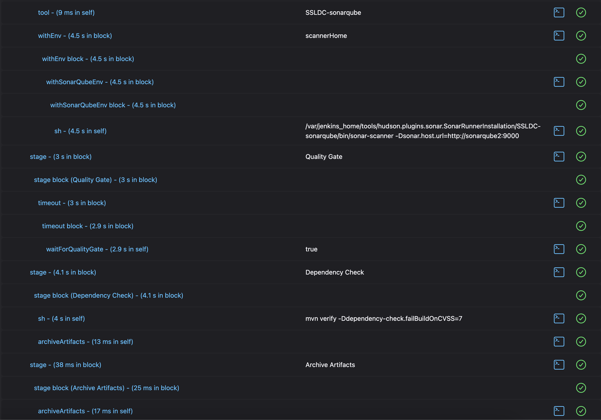
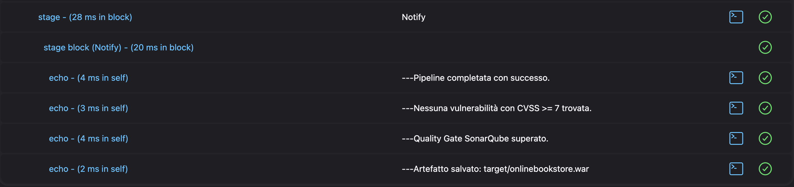

# Report Finale - Progetto di SSDLC - DevSecOps

## 1. Introduzione

Questo progetto ha seguito un approccio Secure Software Development Life Cycle (SSDLC) per integrare pratiche di sicurezza all'interno del ciclo di vita dello sviluppo software. Ho adottato strumenti DevSecOps in un'applicazione Java, analizzando vulnerabilità di codice, dipendenze e configurando pipeline di CI/CD con Jenkins.

---

## 2. Configurazione dell'Ambiente

### 2.1. Requisiti Software

- **Docker** e Docker Compose
- **Jenkins** per orchestrare la pipeline CI/CD
- **SonarQube** per analisi statica del codice (SAST)
- **OWASP Dependency-Check** per analisi delle librerie di terze parti (SCA)

### 2.2. Docker Setup

Per gestire Jenkins e SonarQube, sono stati utilizzati container Docker collegati a una rete condivisa.

**Creazione rete Docker**

```bash
docker network create devsecops-net
```

Esempio `docker-compose.yml` per jenkins:

```yaml
version: "3.8"

services:
  jenkins:
    image: jenkins/jenkins:lts
    container_name: jenkins
    ports:
      - "8080:8080"
      - "50000:50000"
    volumes:
      - jenkins_home:/var/jenkins_home
    restart: unless-stopped

volumes:
  jenkins_home:
```

Per quanto riguarda il container **SonarQube Server** e stato usato questo comando:

```bash
docker run -d --name sonarqube2 -e SONAR_ES_BOOTSTRAP_CHECKS_DISABLE=true -p 9000:9000 sonarqube:latest
```

## 3. Pipeline CI/CD - Stage per Stage

1. **Check-out del codice**

   - Clonazione del repository Git

2. **Build**

   - Compilazione del progetto con `mvn clean -B package`

3. **Analisi SAST**

   - SonarScanner lancia `sonar-scanner` all'interno della pipeline Jenkins

   - Quality Gate monitorato con `waitForQualityGate()`

4. **Analisi SCA**

   - Esecuzione di `dependency-check-maven` via `mvn verify`

   - Build fallisce in presenza di vulnerabilità con CVSS >= 8

5. **Quality Gate**

- La pipeline si interrompe se:

  - SonarQube segnala fallimento

  - Dependency-Check trova vulnerabilità critiche

6. **Archiviazione artefatti**

- Archiviazione del file `.war` prodotto nella cartella `target/`

7. **Notifica**

- Output nel log Jenkins che riassume l’esito della pipeline e l’assenza/presenza di problemi

8. **Configurazione Gate Sicurezza**

- SonarQube: quality gate basato su code smells, duplicazioni e vulnerabilità
- Dependency-Check: soglia fissata a `CVSS >= 8`

## 4. Analisi del Codice con SonarQube

### 4.1. Integrazione Jenkins-SonarQube

- Configurazione credenziali su Jenkins
- Installazione plugin SonarQube Scanner
- Definizione tool name e URL: `http://sonarqube2:9000`

### 4.2. Esecuzione SonarScanner

Nella pipeline Jenkins:

```groovy
stage('Run Sonarqube') {
    environment {
        scannerHome = tool 'SSLDC-sonarqube';
    }
    steps {
        withSonarQubeEnv(credentialsId: 'sonarqube2', installationName: 'LocalSonar') {
            sh "${scannerHome}/bin/sonar-scanner -Dsonar.host.url=http://sonarqube2:9000"
        }
    }
}
```

### 4.3. Quality Gate

E stata inclusa la fase `waitForQualityGate()` per bloccare la pipeline in caso di esito negativo. Questo esito vera dato dal server SonarQube che attraverso un `Webhook` invia a jenkins l'esito.

```groovy
stage('Quality Gate') {
    steps {
        timeout(time: 2, unit: 'MINUTES') {
            waitForQualityGate abortPipeline: true
        }
    }
}
```

### 4.4. Risultati SonarQube

- **Security**: 0 issue
- **Reliability**: 8 issue
- **Maintainability**: 85 issue
- **Coverage**: 0%
- **Duplications**: 8.4%


## 5. Analisi delle Dipendenze (SCA) con OWASP Dependency-Check

### 5.1. Integrazione in Jenkins

Ho configurato Dependency-Check come plugin Maven.

```groovy
stage('Dependency Check') {
  steps {
    sh 'mvn verify'
  }
  post {
    always {
      archiveArtifacts artifacts: 'target/dependency-check-report.html', fingerprint: true
    }
  }
}
```

### 5.2. Threshold di Sicurezza

Ho impostato `failBuildOnCVSS=8` nel pom.xml per bloccare la build in presenza di vulnerabilità gravi.

### 5.3. Report

Il report è stato allegato e archiviato da Jenkins automaticamente:

- [Visualizza report Dependency-Check](/target/dependency-check-report.html)

### 5.4 Tabella delle vulnerabilita principali

# Elenco Vulnerabilità da Dependency Check

### 5.4. Principali Vulnerabilità Rilevate

| CVE ID         | Gravità  | CVSS | Componente             | OWASP Category                 | Descrizione | Suggerimento di fix                               |
| -------------- | -------- | ---- | ---------------------- | ------------------------------ | ------------| ------------------------------------------------- |
| CVE-2023-22102 | HIGH     | 8.3  | mysql-connector-java   | A01: Broken Access Control     | Questa vulnerabilità in Oracle MySQL Connector/J permette a un attaccante non autenticato con accesso di rete di compromettere i connettori MySQL. Una sfruttamento riuscito potrebbe portare al completo takeover del servizio dei Connector MySQL. | Aggiorna a `mysql-connector-java` ≥ 8.1.1         |
| CVE-2024-1597  | CRITICAL | 9.8  | postgresql JDBC Driver | A03: Injection                 | Questo bug colpisce il driver JDBC di PostgreSQL (pgjdbc). È possibile un attacco di SQL injection quando si usa la proprietà di connessione `preferQueryMode=SIMPLE` (che non è la modalità di default) e il codice applicativo contiene query vulnerabili che negano un valore di parametro. Un attaccante può iniettare codice SQL, ottenendo accesso o manipolazione non autorizzati dei dati. | Aggiornare a `postgresql` ≥ 42.7.2                  |
| CVE-2022-41946 | MEDIUM   | 5.5  | postgresql JDBC Driver | A06: Vulnerable Components     | Nel driver JDBC di PostgreSQL (pgjdbc), chiamate a `PreparedStatement.setText(int, InputStream)` o `PreparedStatement.setBytea(int, InputStream)` con InputStream più grandi di 2 KB generano file temporanei nella directory di sistema. Su sistemi Unix-like questi file possono essere leggibili da altri utenti, esponendo informazioni sensibili. | Usare `java.io.tmpdir` privato o aggiornare a ≥ 4.5.0 |
| CVE-2024-7254  | HIGH     | 8.7  | protobuf-java          | A06: Vulnerable Components     | In Protocol Buffers (protobuf) esiste un DoS legato al parsing di dati non affidabili contenenti gruppi annidati o serie di tag SGROUP. L’attacco sfrutta ricorsione non limitata, causando uno stack overflow. | Aggiornare `protobuf-java` ≥ 3.21.7                 |
| CVE-2022-3171  | HIGH     | 7.5  | protobuf-java          | A06: Vulnerable Components | Un problema di parsing con i dati binari nelle versioni core e lite di protobuf-java, può portare a un attacco di denial of service (DoS). Ingressi che contengono più istanze di messaggi incorporati non ripetuti con campi ripetuti o sconosciuti causano la conversione degli oggetti avanti e indietro tra forme mutabili e immutabili, provocando potenzialmente lunghe pause nella garbage collection. | Aggiornare ≥ 3.21.7 o validare input Protobuf         |
| CVE-2022-3509  | HIGH     | 7.5  | protobuf-java          | A06: Vulnerable Components     | Un problema di parsing simile a CVE-2022-3171, ma relativo al textformat nelle versioni core e lite di protobuf-java precedenti alle versioni 3.21.7, può portare a un attacco di denial of service (DoS). | Aggiornare `protobuf-java` ≥ 3.21.7                 |
| CVE-2022-3510  | HIGH     | 7.5  | protobuf-java          | A06: Vulnerable Components     | Un problema di parsing simile a CVE-2022-3171, ma relativo alle estensioni di tipo Message `(Message-Type Extensions)` nelle versioni core e lite di protobuf-java precedenti alle versioni 3.21.7, può portare a un attacco di denial of service (DoS) | Aggiornare `protobuf-java` ≥ 3.21.7                 |
| CVE-2021-22569 | MEDIUM   | 5.5  | protobuf-java          | A06: Security Misconfiguration | Un problema in protobuf-java consentiva l'interleavin (intercalazione) dei campi di `com.google.protobuf.UnknownFieldSet` in modo tale da essere elaborati fuori ordine. Un piccolo payload malevolo può impegnare il parser per diversi minuti creando un numero elevato di oggetti a vita breve, causando pause frequenti e ripetute nel processo. | Aggiornare ≥ 3.16.1 o migliorare il parser Protobuf   |

## 6. Gestione Artefatti

Il file .war generato viene archiviato alla fine della pipeline:

```groovy
stage('Archive Artifacts') {
    steps {
        archiveArtifacts artifacts: 'target/*.war', fingerprint: true
    }
}
```

Nota: il progetto è pacchettizzato come `.war`, non `.jar`.

## 7. Conclusioni

Ho completato con successo le seguenti attività:

- Pipeline CI/CD con Jenkins
- Analisi statica del codice (SonarQube)
- Analisi delle dipendenze con OWASP Dependency-Check
- Quality Gate automatici e vincolanti

Tutti i componenti sono stati eseguiti su Docker e integrati tra loro.

## 8. Screenshot richiesti

- Interfaccia SonarQube (inclusa sopra)
- Pipeline Jenkins completata:
  
  
  
- Artifact `.war` generato (nella cartella `target/onlinebookstore.war`)


## **Repository** 
Il codice sorgente utilizzato per il progetto:

https://github.com/Nick-2002b/Progetto-SSDLC
